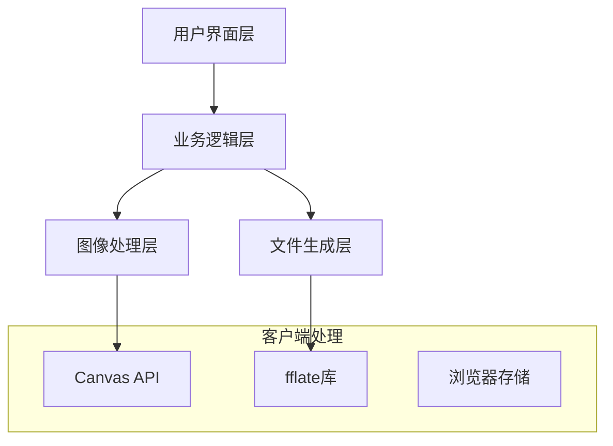
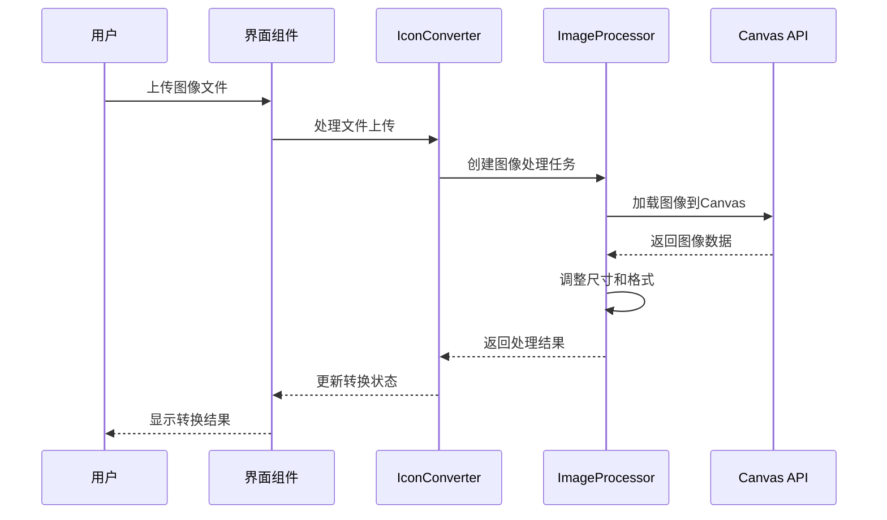

# 设计文档

## 概述

Electron图标转换器采用现代Web技术栈，基于Nuxt 4 + Vue 3构建。系统采用纯客户端架构，使用Canvas API进行图像处理，fflate进行文件打包，确保用户数据隐私的同时提供高效的转换体验。

## 架构

### 整体架构



### 技术栈选择

- **前端框架**: Nuxt 4 + Vue 3 (组合式API)
- **UI组件**: Nuxt UI + Tailwind CSS
- **图像处理**: Canvas API + HTML5 File API
- **文件打包**: fflate
- **类型安全**: TypeScript (严格模式)
- **测试框架**: Vitest + Testing Library

## 组件和接口

### 核心组件结构

```
IconConverterMain.vue (主组件)
├── FileUploadZone.vue (文件上传区域)
├── ImagePreview.vue (图像预览)
├── PlatformSelector.vue (平台选择器)
├── ConversionProgress.vue (转换进度)
└── DownloadSection.vue (下载区域)
```

### 主要接口定义

```typescript
// 平台配置接口
interface PlatformConfig {
  id: 'windows' | 'macos' | 'linux'
  name: string
  formats: IconFormat[]
  enabled: boolean
}

// 图标格式接口
interface IconFormat {
  extension: string
  sizes: number[]
  mimeType: string
}

// 转换结果接口
interface ConversionResult {
  platform: string
  files: GeneratedFile[]
  success: boolean
  error?: string
}

// 生成文件接口
interface GeneratedFile {
  name: string
  blob: Blob
  size: number
  format: string
}
```

### 组合式函数设计

```typescript
// 主转换逻辑
function useIconConverter() {
  const sourceImage = ref<File | null>(null)
  const selectedPlatforms = ref<string[]>([])
  const conversionResults = ref<ConversionResult[]>([])
  const isConverting = ref(false)

  return {
    sourceImage,
    selectedPlatforms,
    conversionResults,
    isConverting,
    uploadImage,
    selectPlatforms,
    convertIcons,
    downloadResults
  }
}

// 图像处理专用
function useImageProcessor() {
  return {
    resizeImage,
    createCanvas,
    generateICO,
    generateICNS,
    generatePNG
  }
}
```

## 数据模型

### 平台规范配置

```typescript
const PLATFORM_CONFIGS: Record<string, PlatformConfig> = {
  windows: {
    id: 'windows',
    name: 'Windows',
    formats: [{
      extension: 'ico',
      sizes: [16, 32, 48, 64, 128, 256],
      mimeType: 'image/x-icon'
    }],
    enabled: true
  },
  macos: {
    id: 'macos',
    name: 'macOS',
    formats: [{
      extension: 'icns',
      sizes: [1024],
      mimeType: 'image/icns'
    }],
    enabled: true
  },
  linux: {
    id: 'linux',
    name: 'Linux',
    formats: [{
      extension: 'png',
      sizes: [16, 32, 48, 64, 128, 256, 512],
      mimeType: 'image/png'
    }],
    enabled: true
  }
}
```

### 状态管理模型

```typescript
interface AppState {
  // 文件状态
  sourceFile: File | null
  imagePreview: string | null

  // 选择状态
  selectedPlatforms: Set<string>

  // 转换状态
  isProcessing: boolean
  progress: number
  currentStep: string

  // 结果状态
  results: Map<string, ConversionResult>
  downloadReady: boolean
}
```

## 错误处理

### 错误分类和处理策略

```typescript
enum ErrorType {
  FILE_UPLOAD = 'FILE_UPLOAD',
  IMAGE_PROCESSING = 'IMAGE_PROCESSING',
  FORMAT_CONVERSION = 'FORMAT_CONVERSION',
  DOWNLOAD_GENERATION = 'DOWNLOAD_GENERATION'
}

interface AppError {
  type: ErrorType
  message: string
  details?: string
  recoverable: boolean
}

// 错误处理策略
const errorHandlers = {
  [ErrorType.FILE_UPLOAD]: (error: AppError) => {
    // 显示用户友好的上传错误信息
    // 提供重新上传选项
  },
  [ErrorType.IMAGE_PROCESSING]: (error: AppError) => {
    // 显示图像处理错误
    // 建议用户尝试不同格式的图像
  },
  [ErrorType.FORMAT_CONVERSION]: (error: AppError) => {
    // 显示转换错误
    // 提供重试选项
  },
  [ErrorType.DOWNLOAD_GENERATION]: (error: AppError) => {
    // 显示下载生成错误
    // 提供重新生成选项
  }
}
```

### 输入验证

```typescript
function validateImageFile(file: File): ValidationResult {
  const validTypes = ['image/png', 'image/jpeg', 'image/jpg', 'image/svg+xml', 'image/webp']
  const maxSize = 10 * 1024 * 1024 // 10MB

  if (!validTypes.includes(file.type)) {
    return { valid: false, error: '不支持的文件格式' }
  }

  if (file.size > maxSize) {
    return { valid: false, error: '文件大小超过限制' }
  }

  return { valid: true }
}
```

## 测试策略

### 测试层级

1. **单元测试**
   - 工具函数测试 (image-utils, file-utils)
   - 组合式函数测试 (useIconConverter, useImageProcessor)
   - 组件逻辑测试

2. **集成测试**
   - 文件上传流程测试
   - 图标转换流程测试
   - 下载生成流程测试

3. **端到端测试**
   - 完整用户工作流测试
   - 跨浏览器兼容性测试

### 测试用例设计

```typescript
describe('图标转换功能', () => {
  describe('文件上传', () => {
    it('应该接受有效的图像文件', async () => {
      // 测试PNG、JPG、SVG、WebP文件上传
    })

    it('应该拒绝无效的文件格式', async () => {
      // 测试PDF、TXT等无效格式
    })

    it('应该处理大文件上传', async () => {
      // 测试文件大小限制
    })
  })

  describe('平台选择', () => {
    it('应该支持单平台选择', () => {
      // 测试单个平台选择
    })

    it('应该支持多平台选择', () => {
      // 测试多平台同时选择
    })
  })

  describe('图标生成', () => {
    it('应该生成符合Windows规范的ICO文件', async () => {
      // 测试ICO文件生成和格式验证
    })

    it('应该生成符合macOS规范的ICNS文件', async () => {
      // 测试ICNS文件生成和格式验证
    })

    it('应该生成符合Linux规范的PNG文件集', async () => {
      // 测试多尺寸PNG文件生成
    })
  })
})
```

### 性能测试

```typescript
describe('性能测试', () => {
  it('应该在合理时间内完成大图像转换', async () => {
    // 测试4K图像转换性能
    const startTime = performance.now()
    await convertLargeImage()
    const endTime = performance.now()
    expect(endTime - startTime).toBeLessThan(5000) // 5秒内完成
  })

  it('应该有效管理内存使用', async () => {
    // 测试内存泄漏
    const initialMemory = performance.memory?.usedJSHeapSize
    await processMultipleImages()
    // 验证内存使用合理
  })
})
```

## 实现细节

### 图像处理流程



### 文件生成策略

1. **ICO文件生成 (Windows)**
   - 使用Canvas API生成6种尺寸图像：16x16、32x32、48x48、64x64、128x128、256x256像素
   - 按ICO格式规范组装二进制数据
   - 创建包含所有尺寸的单一.ico文件
   - 支持32位RGBA透明度

2. **ICNS文件生成 (macOS)**
   - 生成1024x1024像素高分辨率图像
   - 按Apple ICNS格式规范编码
   - 支持Retina显示优化
   - 包含icon_1024x1024.png资源

3. **PNG文件集生成 (Linux)**
   - 生成7种标准尺寸：16x16、32x32、48x48、64x64、128x128、256x256、512x512像素
   - 每个尺寸生成独立的.png文件
   - 使用高质量缩放算法保持图像清晰度
   - 保持透明度和颜色准确性

### 下载优化

```typescript
async function generateDownload(results: ConversionResult[]) {
  if (results.length === 1 && results[0].files.length === 1) {
    // 单文件直接下载
    downloadSingleFile(results[0].files[0])
  }
  else {
    // 多文件使用fflate打包下载
    const { zip } = await import('fflate')

    const files: Record<string, Uint8Array> = {}

    results.forEach((result) => {
      result.files.forEach((file) => {
        const path = `${result.platform}/${file.name}`
        files[path] = new Uint8Array(await file.blob.arrayBuffer())
      })
    })

    zip(files, (err, data) => {
      if (err)
        throw err
      const blob = new Blob([data], { type: 'application/zip' })
      downloadZipFile(blob, 'electron-icons.zip')
    })
  }
}
```
